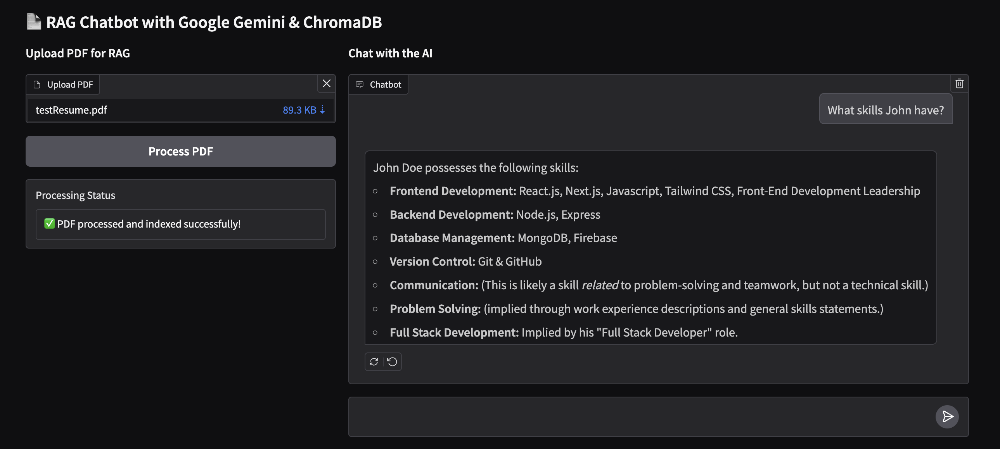

🔴 DO NOT UPLOAD CONFIDENTIAL OR SENSITIVE INFORMATION! 🔴

#### Clone app
```
git clone https://github.com/Imantz/py-langchain-rag.git && cd py-langchain-rag
```

#### Installation
```
python3 -m pip install -r requirements.txt
```

#### Copy .env.example to .env
```
cp .env.example .env
```
**don't forget to set .env file GEMINI_API_KEY**

#### Run the App
```
python3 app.py
```

Visit: http://127.0.0.1:7860

